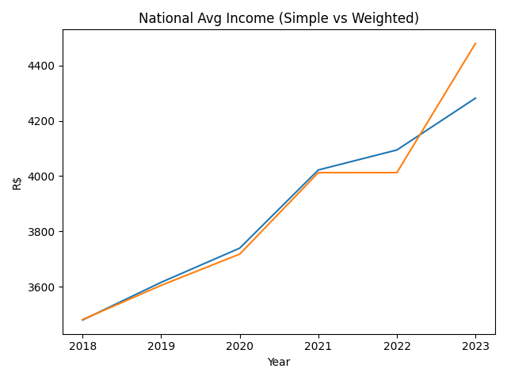
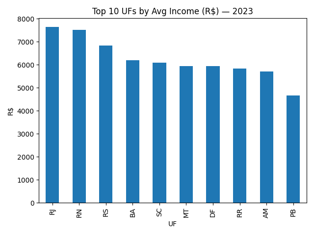
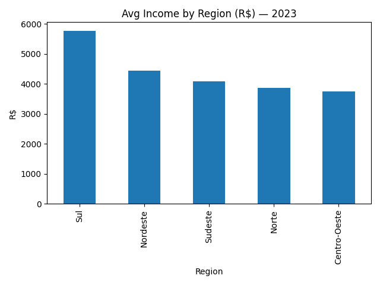
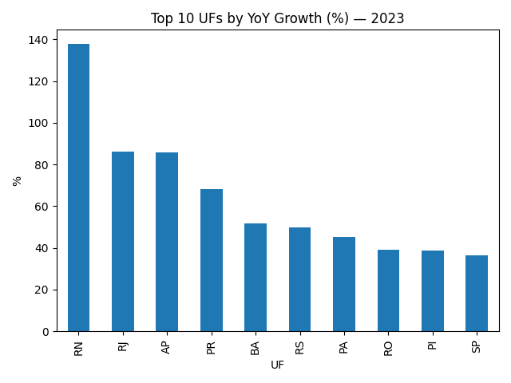

# Análise de Renda no Brasil — Data Analytics Project

 
 
 


Projeto de portfólio simulando um fluxo real de trabalho de um **Analista de Dados Jr**, usando dados de renda por UF/região (dataset sintético inspirado em indicadores IBGE/PNAD).

## Objetivo
Analisar **níveis**, **tendências** e **diferenças regionais** de renda, extraindo insights acionáveis e preparando uma base pronta para dashboard.

## Principais Perguntas de Negócio
- Quais UFs apresentam maior/menor renda média no ano mais recente?
- Como a renda evoluiu ao longo do tempo (média simples vs ponderada pela população)?
- Existe evidência de desigualdade (variabilidade) relevante entre estados?
- Quais estados tiveram maior crescimento (YoY) no último ano?

## Entregáveis
- ✅ Dataset tratado (`data/renda_brasil_clean.csv`)
- ✅ Notebooks de ETL e EDA (KPIs, ranking, tendência, desigualdade, crescimento)
- ✅ Consultas SQL (KPIs, ranking, YoY, dispersão)
- ✅ Guia completo para construir dashboard no Power BI (`dashboard/README_dashboard.md`)
- ✅ Imagens de preview para README (`images/`)

## Dashboard Preview
### Trend (Simple vs Weighted)


### Top 10 UFs (Latest Year)


### Income by Region (Latest Year)


### YoY Growth (Latest Year)


## Repository Structure
```
analise-renda-brasil/
├── data/                 # raw & clean datasets
├── notebooks/            # ETL + EDA
├── sql/                  # schema + analysis queries
├── dashboard/            # Power BI guide + DAX measures
├── images/               # charts/dashboard previews
└── docs/                 # data dictionary
```

## How to Run
1) Install dependencies
```bash
pip install -r requirements.txt
```

2) Run notebooks in order
- `notebooks/01_etl.ipynb`
- `notebooks/02_eda.ipynb`

## Notes
This dataset is **synthetic** for portfolio purposes. The workflow (ETL → EDA → SQL → Dashboard) is designed to mirror real-world data analyst tasks.
