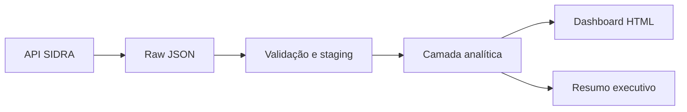

# Renda no Brasil — pipeline de dados oficiais do IBGE

Case end-to-end de engenharia e análise de dados que extrai uma série trimestral oficial do SIDRA, valida a cobertura das 27 UFs, cria camadas analíticas e publica um dashboard estático reproduzível.

[](https://github.com/MauricioTaguchi/analise-renda-brasil/actions/workflows/ci.yml)

## Resultado

- fonte oficial: **IBGE/SIDRA, tabela 6472, variável 5933**;
- indicador: rendimento médio mensal real habitualmente recebido em todos os trabalhos;
- extração automatizada dos últimos 20 trimestres;
- validações de qualidade, cobertura, duplicidade e valores inválidos;
- ranking por UF, variação em quatro trimestres e série nacional exploratória;
- [dashboard HTML autocontido](dashboard/index.html) e [resumo executivo](docs/EXECUTIVE_SUMMARY_OFFICIAL.md).

## Pipeline


```mermaid
flowchart LR
    A[API SIDRA] --> B[Raw JSON]
    B --> C[Validação e staging]
    C --> D[Camada analítica]
    D --> E[Dashboard HTML]
    D --> F[Resumo executivo]
```

Detalhes das decisões técnicas estão em [docs/ARCHITECTURE.md](docs/ARCHITECTURE.md).

## Como reproduzir

```bash
python -m venv .venv
.venv\Scripts\activate
pip install -r requirements.txt
python -m src.income_pipeline
pytest
```

Para executar também os notebooks legados, instale `requirements-notebooks.txt` em um caminho curto no Windows.

O pipeline consulta a API pública do SIDRA e atualiza:

```text
data/raw/ibge_sidra_6472.json
data/staging/income_by_state_quarter.csv
data/analytics/latest_income_ranking.csv
data/analytics/national_income_trend.csv
docs/EXECUTIVE_SUMMARY_OFFICIAL.md
dashboard/index.html
```

## Qualidade e rastreabilidade

- testes unitários com cobertura mínima de 80%;
- lint com Ruff;
- CI no GitHub Actions;
- Dependabot para Python e Actions;
- resposta bruta preservada para auditoria;
- dependências versionadas para builds reprodutíveis.

## Estrutura

```text
analise-renda-brasil/
├── src/             # extração, transformação, validação e publicação
├── tests/           # testes automatizados
├── data/            # camadas raw, staging e analytics
├── dashboard/       # dashboard HTML e material legado de Power BI
├── docs/            # arquitetura, resumo e dicionário
├── notebooks/       # análise exploratória legada
└── sql/             # consultas analíticas legadas
```

## Transparência sobre o conteúdo legado

Os notebooks, CSVs históricos, consultas SQL e imagens originalmente incluídos neste repositório usam uma **base sintética** criada para demonstrar o fluxo analítico. Eles permanecem como material complementar e estão identificados como tal. O pipeline em `src/`, os artefatos em `data/raw`, `data/staging`, `data/analytics`, o dashboard HTML e o resumo executivo usam a série oficial do IBGE.

## Limitações

A média simples entre UFs é uma métrica exploratória e não substitui o agregado oficial ponderado do IBGE. Revisões metodológicas da PNAD Contínua podem alterar valores históricos. Consulte os metadados da [tabela 6472 do SIDRA](https://sidra.ibge.gov.br/tabela/6472) antes de usar os resultados em decisões econômicas.

## Tecnologias

Python, Pandas, Pytest, Ruff, GitHub Actions, HTML/CSS e API SIDRA/IBGE.

## Autor

**Mauricio Taguchi** · [LinkedIn](https://www.linkedin.com/in/mauriciotaguchi/) · [GitHub](https://github.com/MauricioTaguchi)
