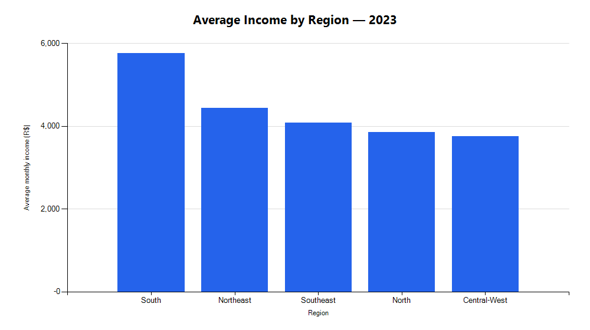
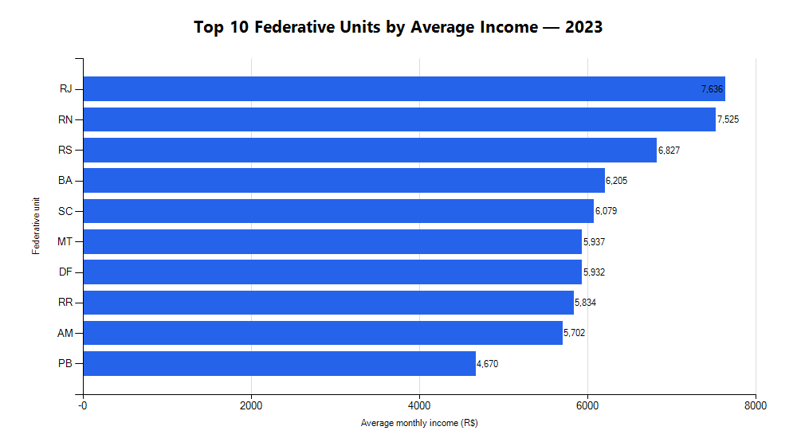
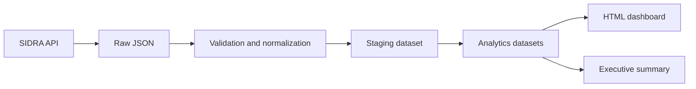

# Brazil Income Analysis — Official IBGE Data Pipeline

An end-to-end data engineering and analytics case study that extracts an official quarterly income series from IBGE SIDRA, validates all 27 Brazilian federative units, produces analytics-ready datasets, and publishes a reproducible static dashboard.

[](https://github.com/MauricioTaguchi/analise-renda-brasil/actions/workflows/ci.yml)

## Project outcome

- Official source: **IBGE SIDRA table 6472, variable 5933**
- Indicator: real average monthly income usually received from all jobs
- Automated extraction of the latest 20 quarters
- Coverage, duplicate, null, and invalid-value checks
- Ranking by federative unit, four-quarter change, and exploratory national trend
- Self-contained [HTML dashboard](dashboard/index.html)
- Generated [executive summary](docs/EXECUTIVE_SUMMARY.md)
- Reproducible Python tests, linting, and continuous integration

## Portfolio preview

| Regional comparison | Federative-unit ranking |
|---|---|
|  |  |

## Pipeline


```mermaid
flowchart LR
    A[SIDRA API] --> B[Raw JSON]
    B --> C[Validation and normalization]
    C --> D[Staging dataset]
    D --> E[Analytics datasets]
    E --> F[HTML dashboard]
    E --> G[Executive summary]
```

See [Architecture](docs/ARCHITECTURE.md) for design decisions and data-quality guarantees.

## Run locally

```bash
python -m venv .venv
.venv\Scripts\activate
pip install -r requirements.txt
python -m src.income_pipeline
pytest
```

On Linux or macOS, activate the environment with `source .venv/bin/activate`.

For a deterministic offline rebuild from the committed source snapshot:

```bash
python -m src.income_pipeline --input data/raw/ibge_sidra_6472.json
```

To run the legacy analytical notebooks, also install `requirements-notebooks.txt`.

## Generated artifacts

The pipeline reads the public SIDRA API and refreshes:

```text
data/raw/ibge_sidra_6472.json
data/staging/income_by_state_quarter.csv
data/analytics/latest_income_ranking.csv
data/analytics/national_income_trend.csv
docs/EXECUTIVE_SUMMARY.md
dashboard/index.html
```

The raw JSON intentionally preserves the original labels returned by IBGE for auditability. All normalized fields, generated datasets, documentation, tests, SQL, notebooks, and user-facing content use English.

## Quality and traceability

- Unit tests with a minimum coverage threshold of 80%
- Ruff linting
- GitHub Actions continuous integration
- Dependabot updates for Python and GitHub Actions
- Original API response preserved for auditing and reprocessing
- Version-pinned dependencies for reproducible builds

## Repository structure

```text
├── src/             # extraction, transformation, validation, and publishing
├── tests/           # automated tests
├── data/            # raw, staging, analytics, and legacy sample datasets
├── dashboard/       # generated HTML dashboard and Power BI guide
├── docs/            # architecture, executive summary, and data dictionary
├── notebooks/       # complementary exploratory analysis
├── images/          # charts generated from the sample dataset
└── sql/             # complementary analytical queries
```

## Data transparency

The production pipeline in `src/` and the artifacts in `data/raw`, `data/staging`, and `data/analytics` use the official IBGE series.

The complementary notebooks, SQL examples, Power BI guide, chart images, and `data/brazil_income_*.csv` files use a **synthetic portfolio dataset**. They demonstrate the analytical workflow and are clearly separated from the official results. They must not be used for real-world economic conclusions.

## Methodological limitations

The simple average across federative units is an exploratory measure. It does not replace the official population-weighted national aggregate published by IBGE. Continuous PNAD methodological revisions may change historical values. Review the metadata for [SIDRA table 6472](https://sidra.ibge.gov.br/tabela/6472) before using the results in economic decisions.

## Technology stack

Python, Pandas, Pytest, Ruff, GitHub Actions, PostgreSQL-compatible SQL, HTML/CSS, Power BI, and the IBGE SIDRA API.

## Author

**Mauricio Taguchi** · [LinkedIn](https://www.linkedin.com/in/mauriciotaguchi/) · [GitHub](https://github.com/MauricioTaguchi)
