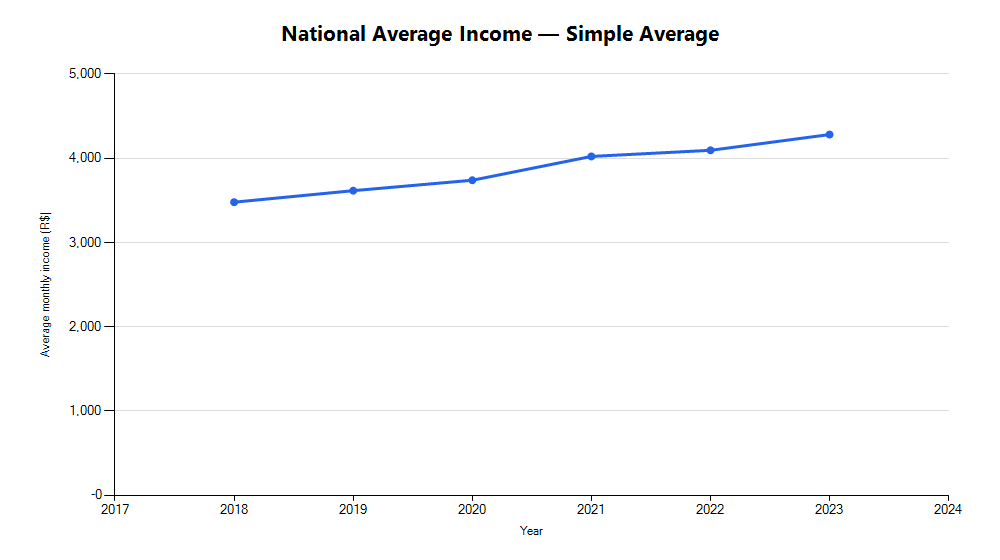

# Análise de renda no Brasil — estudo com dados sintéticos

Projeto end-to-end de análise de dados que simula o trabalho de um **Analista de Dados Júnior**, passando por ETL, análise exploratória, SQL, definição de indicadores e especificação de um dashboard em Power BI.

> **Transparência sobre a fonte:** este projeto não utiliza microdados oficiais do IBGE ou da PNAD. A base é sintética, criada exclusivamente para portfólio e inspirada na estrutura de indicadores regionais brasileiros. Os números não devem ser usados para conclusões sobre a economia real.



## Objetivo

Demonstrar como transformar uma base bruta em uma análise rastreável e comunicável:

1. validar e tratar os dados;
2. criar métricas consistentes;
3. responder perguntas de negócio com Python e SQL;
4. converter resultados técnicos em uma proposta de dashboard;
5. documentar limitações e próximos passos.

## Perguntas analisadas

- Quais UFs apresentam os maiores e menores valores de renda média no cenário?
- Como os valores evoluem entre 2018 e 2023?
- Quais diferenças aparecem entre regiões?
- Como a média simples difere da média ponderada pela população?
- Quais UFs apresentam maior variação anual no conjunto sintético?

## Resumo executivo do cenário

A base contém **162 registros**, cobrindo 27 UFs entre 2018 e 2023. No último ano disponível:

- o RJ apresenta o maior valor sintético de renda média: **R$ 7.636,42**;
- GO apresenta o menor valor sintético: **R$ 1.397,86**;
- a média simples entre as UFs é **R$ 4.282,05**;
- a média ponderada pela população é **R$ 4.480,14**.

As variações elevadas observadas em algumas UFs reforçam uma limitação importante: os dados servem para validar o fluxo analítico, não para representar tendências econômicas reais.

## Entregáveis

- [Notebook de ETL](notebooks/01_etl.ipynb)
- [Notebook de análise exploratória](notebooks/02_eda.ipynb)
- [Consultas e modelagem SQL](sql/analysis.sql)
- [Dicionário de dados](docs/data_dictionary.md)
- [Especificação do dashboard e medidas DAX](dashboard/README_dashboard.md)
- [Dataset tratado](data/renda_brasil_clean.csv)
- visualizações exportadas em `images/`

## Estrutura

```text
analise-renda-brasil/
├── dashboard/      # Especificação do Power BI e medidas DAX
├── data/           # Bases sintéticas bruta e tratada
├── docs/           # Dicionário e limitações dos dados
├── images/         # Visualizações geradas na análise
├── notebooks/      # ETL e análise exploratória
├── sql/            # Esquema, carga e consultas analíticas
└── requirements.txt
```

## Como reproduzir

```bash
python -m venv .venv
.venv\Scripts\activate
pip install -r requirements.txt
jupyter notebook
```

Execute os notebooks nesta ordem:

1. `notebooks/01_etl.ipynb`
2. `notebooks/02_eda.ipynb`

## Tecnologias

Python, Pandas, Jupyter Notebook, SQL, Power BI, DAX e Git.

## Limitações e evolução planejada

- substituir a base sintética por uma fonte pública oficial e versionada;
- automatizar download, validação e atualização dos dados;
- publicar o dashboard interativo;
- adicionar testes automatizados para as transformações do ETL;
- produzir uma análise segmentada por escolaridade, gênero e faixa etária quando a fonte real permitir.

## Autor

[Maurício Ryo Toita Taguchi](https://github.com/MauricioTaguchi) · [LinkedIn](https://www.linkedin.com/in/mauriciotaguchi/)
