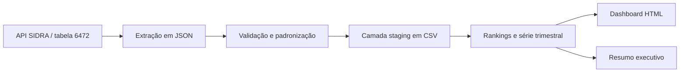

# Arquitetura do case oficial

## Decisões

- A resposta bruta é preservada para auditoria e reprocessamento.
- A camada `staging` usa nomes estáveis em inglês e valores numéricos tipados.
- A validação interrompe a execução diante de duplicidades, valores inválidos ou cobertura incompleta das 27 UFs.
- Os artefatos analíticos são CSVs simples para facilitar consumo por Power BI, Excel, SQL ou notebooks.
- O dashboard é estático e autocontido: abre no navegador sem servidor ou dependência adicional.

## Limitações

O indicador é uma média por UF e não deve ser agregado como se fosse renda individual. A média nacional exibida no dashboard é uma média simples entre UFs, útil para comparação exploratória, mas não substitui o agregado oficial ponderado do IBGE.
