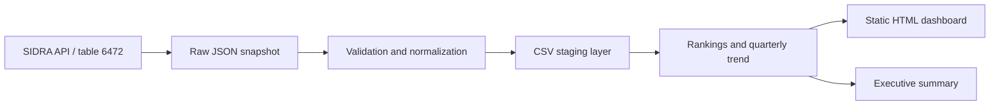

# Official Pipeline Architecture

## Design decisions

- The original API response is preserved for auditing and deterministic reprocessing.
- The staging layer uses stable English field names and typed numeric values.
- Quarter labels and Brazilian macro-region categories are normalized to English.
- Validation stops the pipeline when it detects duplicates, invalid values, missing required fields, or incomplete coverage of the 27 federative units.
- Analytics outputs use plain CSV files so they can be consumed by Power BI, Excel, SQL, or notebooks.
- The dashboard is static and self-contained, so reviewers can open it without a server or additional dependencies.
- Raw SIDRA labels remain in their original language because altering source evidence would weaken traceability.

## Data layers

| Layer | Purpose | Main artifact |
|---|---|---|
| Raw | Immutable source evidence | `data/raw/ibge_sidra_6472.json` |
| Staging | Validated, normalized observations | `data/staging/income_by_state_quarter.csv` |
| Analytics | Ranking and trend datasets | `data/analytics/*.csv` |
| Presentation | Human-readable findings | `dashboard/index.html`, `docs/EXECUTIVE_SUMMARY.md` |

## Methodological limitation

The source indicator is an average for each federative unit and must not be aggregated as if it represented individual-level income. The dashboard's national value is a simple average across federative units. It supports exploratory comparison but does not replace the official population-weighted national aggregate published by IBGE.
